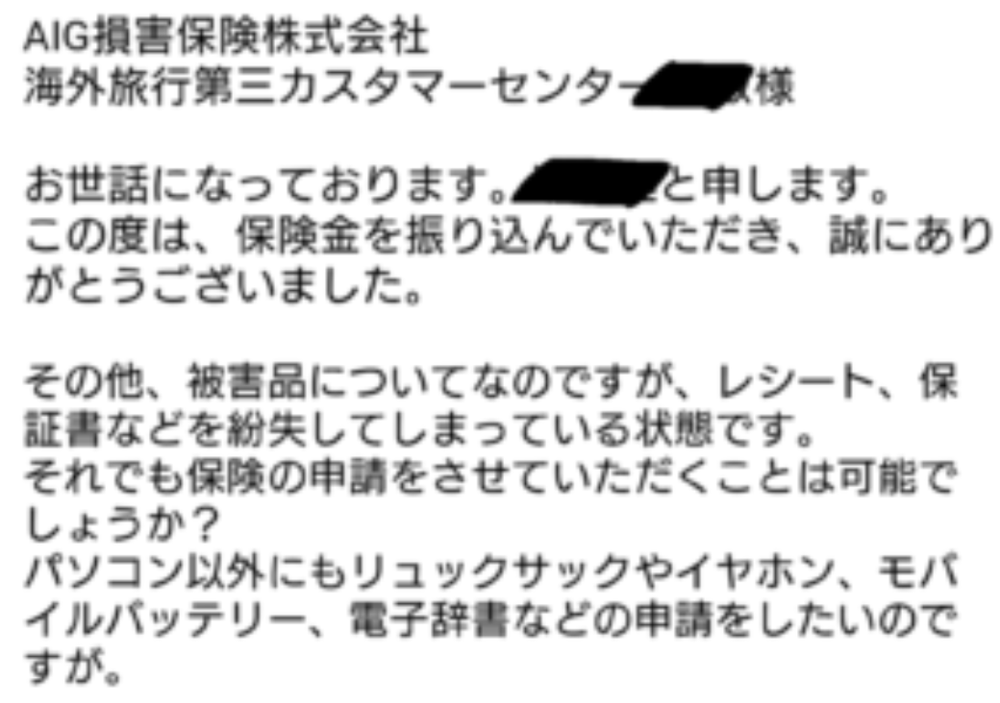
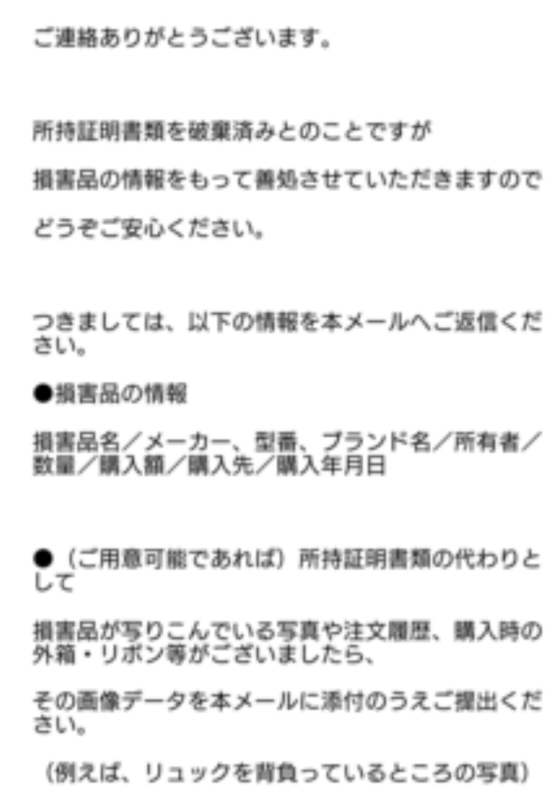

### はじめに

今回の記事は、各種保険に加入してから日本を出発される方に読んでていただきたい内容です。 

いざ保険金を請求しようとした際に問題が起こらないよう、事前にチェックしておいていただきたいことについて書いていきます。

### 保険金の請求

[前回の記事]()で書いたように私はマレーシアで車上荒らしにあいました。

幸い、AIGの海外留学保険に入っていたので、携行品被害というカテゴリーで保険金を頂くことができました。

ここで注意していただきたいポイントが1つあります。
 
<b>それは、携行品被害で保険金を請求する場合、「損害品購入時の領収書・保証書・取扱説明書等（原本）」が必要であるということ。</b>

たとえ損害品の値段を頭で覚えていたとしても、上記の様な証明書がなければ、充分な額の保険金をもらえない、また最悪の場合一切もらえないということに繋がりかねません。

携行品被害で保険金を請求する場必要なものはいくつかありますが、領収書等はその中でもとくに重要なものです。

またなくしてしまった場合、新しいのを手に入れるのは難しいです。

なので、海外保険とくに携行品被害に入る際は、高額商品（パソコンやスマホ、カメラなど）の領収書、保証書、取扱説明書が自分の手元にあるのか確かめてください。

<b>そして、留学などで一時的に長期間実家を離れる場合は、それらの原本の1つを留学先に持っていくことをオススメします。 </b>

留学先から領収書以外の書類を先に保険会社に郵送し、実家から領収書を郵送してもらうという形でも問題はないと思います。

しかし、すべてをまとめて送った方が片方だけまだ届いていないというような状況になることもなく素早く保険金を手に入れることができると思います。

なので、最低限パソコンやスマホの領収書だけでも持っていくことをオススメします。取扱説明書は、日本の実家に置いておきましょう。リスクヘッジです。

### すべての領収書が必要？

しかし、盗られる心配を一度はじめると、すべての領収書がいるのではないかと心配になるかもしれません。 

大丈夫です。隅々まで領収書を用意する必要はありません。

本当に盗られたら困る、自分にとっての高額商品の領収書を用意してください。

<b>私の場合、今回盗まれたもの（リュック、パソコン、モバイルバッテリー、イヤホン、電子辞書、シャツ、学校書類）のうち領収書を持っていたのはパソコンだけでした。</b>

そこでまずはパソコンだけの請求を行い、後に以下のようにメールを送りました。

すると以下のように対応していただけました！

このように一点確実な証明書を提出すれば、柔軟に対応していただける確率も上がります！

本当に柔軟に対応していただいて助かりました。
ありがとうございました。。
 
### 結論

1. 海外保険（とくに携行品被害）に入る際は、盗られて困るモノの領収書が手元にあることを確かめておいてください。 
2. 留学などで長期間滞在する場合は、領収書・保証書・取扱説明書のうち最低1つは持っていってください。
3. 本当に自分にとって高額で盗られたら困るモノだけ領収書を持っていってください。 

以上です！留学に持っていくものリストの中に領収書というのは、あまり見たことがありませんが、本当に大事だと思います！  

とくに心配性の方、リスクヘッジをしたい方は、持っていきましょう！！

現地で買えるものはそんなに持っていかなくて大丈夫なので、こういった現地で手に入らないものを持っていくことが大事だと感じました。

最後まで読んでいただきありがとうございました！！ みなさんの留学、旅行が最高のものになることを願っています！