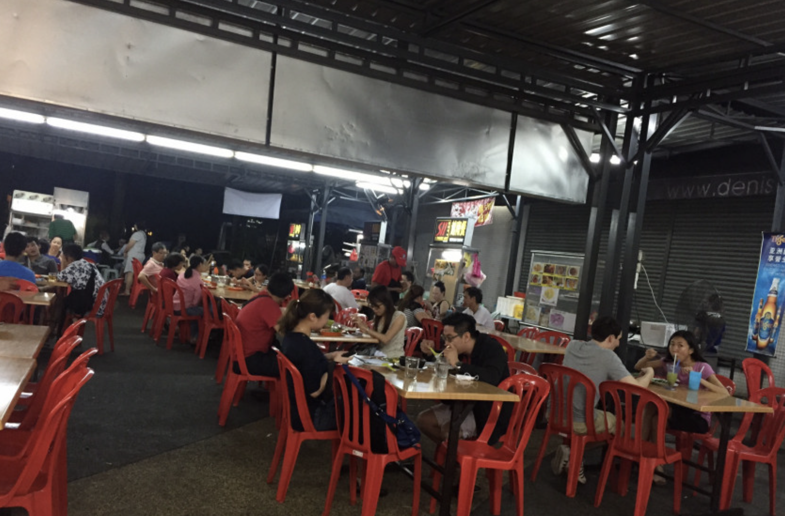
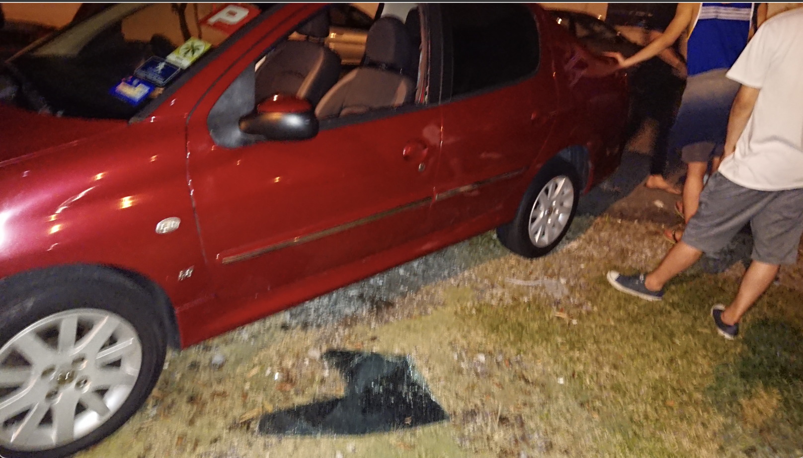

### はじめに 

今回の記事では、これまでのマレーシア生活約3か月を振り返って1番印象的だった出来事について書こうと思います。

それはズバリ、車上荒らしの被害にあってしまったことです。

マレーシア生活が始まり2か月が経過しようとしていた7月23日、私は友人5人と車で晩御飯を食べに出掛けていました。

向かった先は、マレーシアでよく見かける「屋台×外テーブル」のレストラン。

レストラン専用の駐車場などはないので、路上に駐車してレストランへ向かいました。

<b>私と友人2人は大学帰りの重たいリュックを持っていたため、シートの下に隠れるように鞄を置き、手ぶらでレストランへ向かいました。</b>

そして美味しいご飯を食べ、さあ帰ろうと車に戻ると、、、

あーーーーーーーー完全にやられていました。。

助手席の窓ガラスを綺麗に割られ、後部座席のシート下に置いていたリュック3つが無くなっていました。。

私ともう1人のリュックには、ノートパソコンが入っていました😱

私は泥棒の被害にあったのがはじめてだったので、何が起こったのかを理解するまで少し時間がかかり、状況を理解できた後、パソコンを盗られた事実に震えまくりました。。

バッグ、その他電子辞書なども入っていたため、私の被害総額は約17万円。

その後、近くの警察へ向かい、被害届けを提出しました。

<b>保険に加入済で、携行品被害で保険金を請求したい場合は、警察の被害届けが必要なので、被害にあった場合は必ず警察に届け出ましょう。</b>

<b>警察に被害届けを出しに行った際、私が日本人であることを伝えると「Welcome to Malaysia lol」と皮肉を込めて言われました。</b>よお、これがマレーシアだぜっていうニュアンスでした。

なに笑ってんねん😠って感じです。

しかしその言葉に表れているように、この様な軽犯罪はマレーシアで頻発しているようです。

<b>また、たとえトランクやシートの下にきちんと鞄を隠していたとしても、盗られる場合があるそうです。それは、加害者が隠れたところから狙いを定めているからだそう。
</b>

マレーシアは、東南アジアの中でも治安がとても良い方であると感じます。

しかし、車を離れる際など、ほんの一瞬でも荷物から目を離すと被害にあってしまう可能性があります。

学び1：<b>盗られて困るものは、常に自分に身に付けておきましょう！！！</b>

また警察に行って思ったことですが、<b>警察の被害届けが全部マレー語で書かれていたり警察の方が英語を話せない場合があります。</b>

マレーシアはかなり英語が通じる国ではありますが、公共施設の場合は注意です。
英語でのコミュニケーションが取れない可能性もあるので、マレー語を話せる方に付いてきてもらうのがベストであると思います。

私の場合、マレーシア人の友達と警察に行ったので彼らがいたのが心強かったです。

学び2：<b>マレーシアの警察に行く場合は、できるだけマレー語を話せる方に付いてきてもらうべき。</b>

以上、車上荒らしの被害にあい、カバン一式を盗られた経験から感じたことを書かせていただきました。

最後まで読んでいただきありがとうございました！！

「命が1番大事」、そして「保険会社の重要さ」も改めて感じる経験でした。

ぜひ、東南アジアなどを旅行される際はこの情報を役立てていただければと思います。

役に立ったと感じていただけましたら、シェアしていただけると嬉しいです。