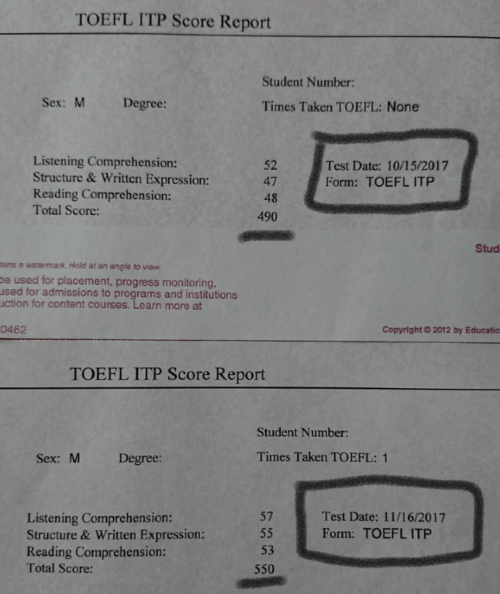
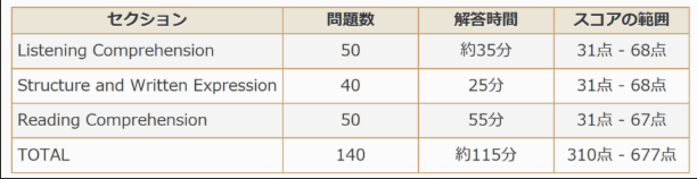
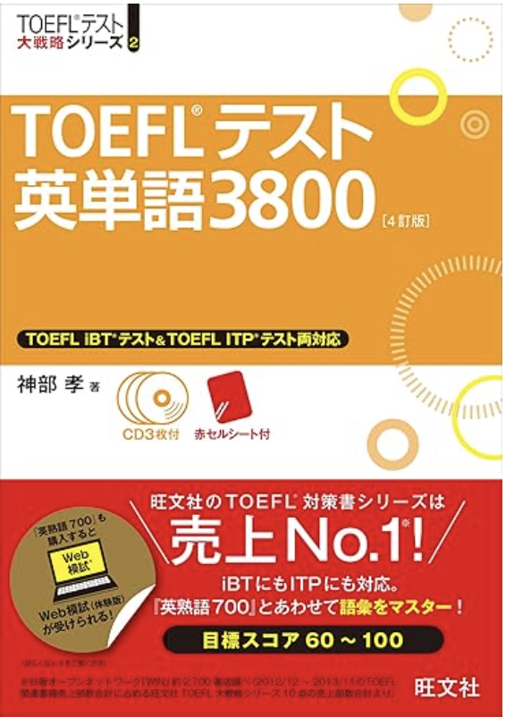
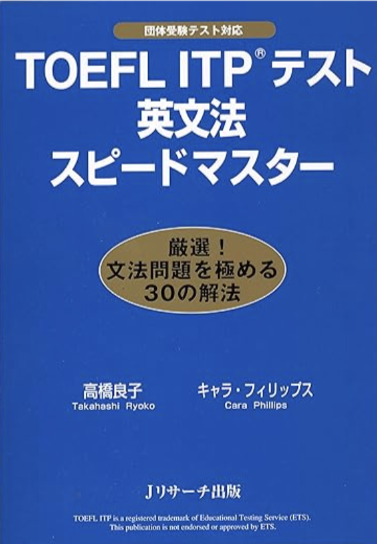

### はじめに

留学のプログラムによってはTOEFLなどで、一定の点数以上を取らないと参加できないということがありますよね。
それによって焦っている方も多いはず。

過去2017年の僕もそうでした。

[参加した留学プログラム](https://www.iccworld.co.jp/ibp/course/sunway/curriculum)がTOEFL itpで515点以上（677点満点）を取らないと参加できないプログラムでした。

なんとなくイケるだろうと、一度受けてみると結果は490点・・・・

「やばっっ・・😨」

「留学の申し込み期限があったので、受けられるチャンスは次の1回だけ。しかもたった1カ月後🤮」

という状況でした。必死で作戦を練りました。

どうすれば短期間で点数を上げられることができるのか。

<b>戦略を立てて1カ月勉強した結果、点数を490点から550点へと大幅にアップさせることができました🥳</b>

ではその勉強法、戦略について書いていきます。

### そもそもTOEFL itpの点数配分、時間配分は？

このテストは3つのセクションに分かれています。

リスニングセクション、文法セクション、長文読解セクションです。677点満点の試験です。

### 単語力がすべてを決める

単語力がほぼすべてを決めると言っても過言ではありません。

TOEFLには大きな特徴があります。

それは問題内容が非常にアカデミックであるということ！

それも当然。TOEFLは英語圏大学（とくにアメリカ）への入学を申しこむ際に求められる試験で、学生がちゃんと英語で授業についていけるかを測る試験なので、試験の内容も当然アカデミックな内容になるのです。

たとえば、リスニングの内容が大学教授の授業を聞いている設定であったり、長文問題が学術論文を読解する問題であったりします。

<b>つまり学術的な単語を覚えないと対応できないのです！</b>

そこで私はこの単語帳を使用しました。

[TOEFLテスト英単語3800 4訂版](https://www.amazon.co.jp/dp/4010944315)

TOEFLによく出る単語をまとめてくれているので、TOEFLの点数を上げるためには必須の単語帳です。

CDも付いているので、私は1カ月間CDを聞きながら毎日音読しました。

ちゃんと手・耳・口を使って勉強すると1カ月でも単語力は上がります。

### 一番点数が伸びやすいのは文法

最初に説明した通り、TOEFL itpには大きく3つのセクションがあります。
リスニング、文法問題、長文読解です。

<b>この中で文法問題のセクションはテクニックだけですぐに伸びます。
1番点数を伸ばしやすいポイントです。</b>

オススメはこの参考書です。

[TOEFL ITP(R)テスト英文法スピードマスター](https://www.amazon.co.jp/dp/4863921551)

文法問題の解法が30パターン掲載されています。
解法パターンを知っておくと楽です。

いわば一種のドーピングのようなものです。
根本的な英語力は上がりませんが、文法問題にはめっちゃ強くなります。

### 時間配分に慣れる

最後はやはり慣れです。

長文問題はとくに見直している時間もないほど時間に追われます。

どれぐらいのスピード感が必要なのかを知るには慣れることがもっとも大切です。とにかく本番までに過去問は何度かこなしましょう。

[TOEFL ITP(R)テスト 公式テスト問題＆学習ガイド](https://www.amazon.co.jp/dp/4327430730)

ぶっつけ本番は本当に危険です、、

事前にきちんと時間配分を決めて、自分がその時間配分通りに問題を解けるかどうか実践しましょう。これだけでもかなり点数は変わります。

難しい問題に時間をかけてしまい、本来なら解けるレベルの問題を時間不足で落としてしまうのは非常にもったいないです。

もう一度言います。事前に必ず数回は過去問を解きましょう！！

### まとめ

短期間でTOEFL itpの点数をアップさせるために大事なことは3つです。

1. TOEFLテスト英単語3800をやる！単語力がやっぱり重要。
2. 英文法セクションの点数アップが一番簡単なので対策をする。
3. 事前に数回は過去問を解いて時間配分に慣れる。

では最後まで読んでいただきありがとうございました！！

TOEFL、そしてその先に待っている留学、頑張ってください！！！