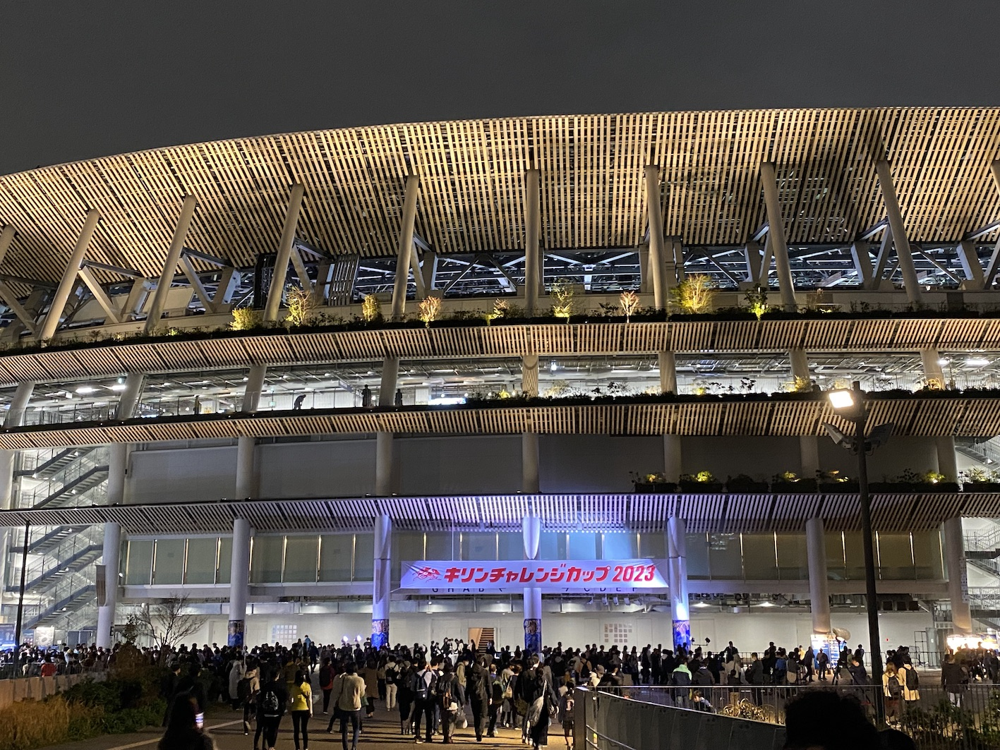
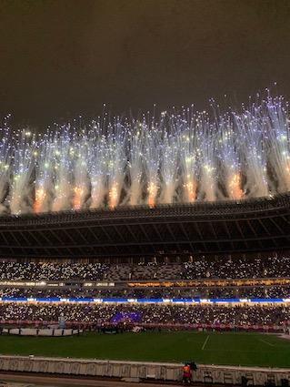
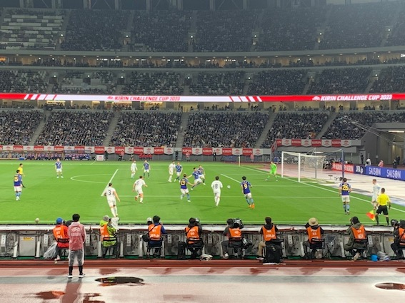
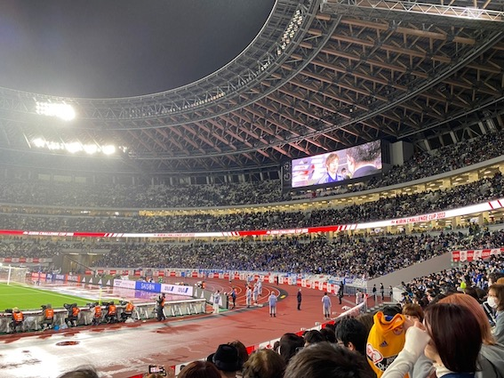

3/24（金）の19:30キックオフの、日本対ウルグアイの試合を見てきました。

当日は早めに仕事を終わらせて、国立競技へ。到着すると、すでにすごい熱気でした！

今回取った席は、1層バック134ブロックの7列目でした。つまり最前列から7列目だったので、かなり見やすかったです。

声出し応援OKとのことで、声出しの練習などが行われ、その後19:20ごろから選手入場前の花火が打ち上がりました！

試合中はこんな感じで、9番の三笘選手を見るのには絶好の位置でした！
ちなみに後半は伊東純也選手がよく見える位置でした。

結果は、1対1の同点。
試合後、伊藤純也選手のインタビューも見れました。

当日はかなり大粒の雨が降っていたのですが、幸い風は弱く、最前列あたりでも雨の心配は無かったです！

久しぶりの現地でのスポーツ観戦、楽しかったです。次は野球を見に行きたい。