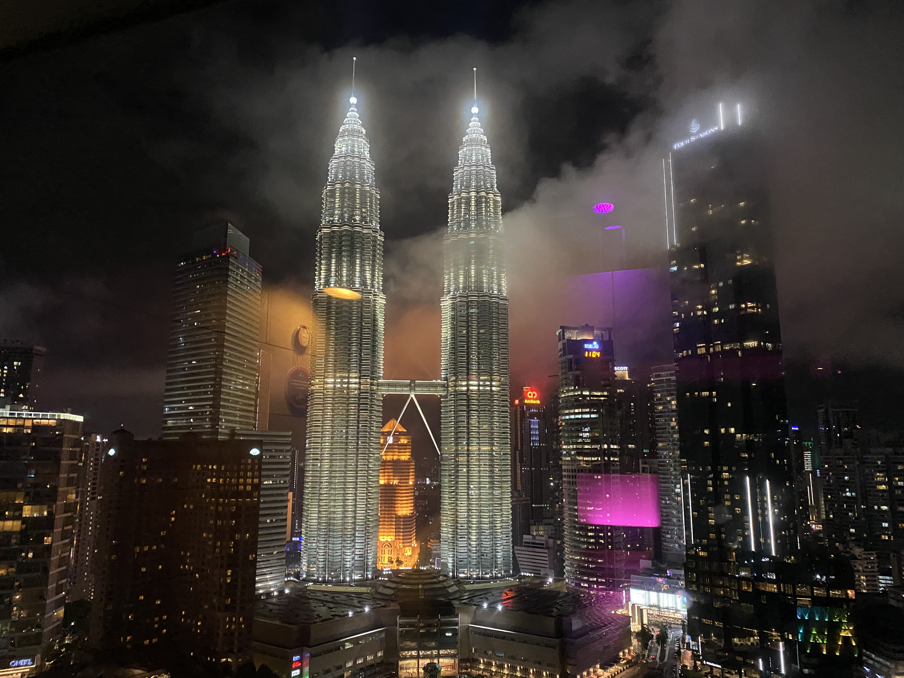
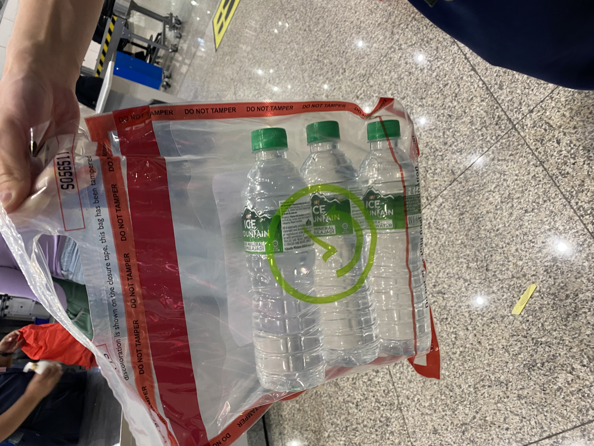
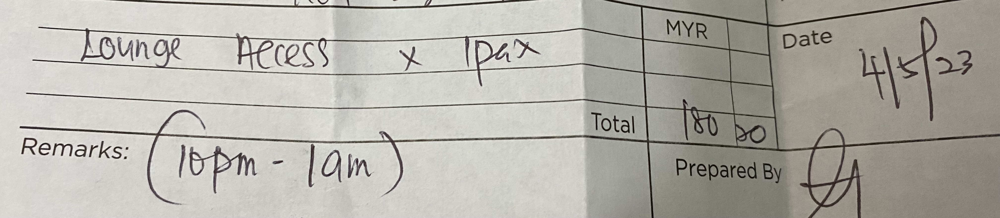

### 前置き

2023年のGWにタイのプーケットと、マレーシアのクアラルンプールに行ってきました。マレーシアのクアラルンプール国際空港で気を付けるべきことについて、備忘録として残そうと思います。

### 水を買うタイミング難しい問題

クアラルンプール国際空港ターミナル1では手荷物検査のタイミングが厄介です。

制限エリア内に入っても、出国審査の前後になっても手荷物検査はなく、出発ゲートの目の前まで来ることができます。
そして、bording timeの時間になって、ようやく出発ゲート前で手荷物検査が行われます。

2014年の[この記事](https://blog-tourismmalaysia.jp/archives/51968171.html)時点では、出国審査後すぐと出発ゲート前の2回手荷物検査が行われていたみたいですが、今回は出発ゲート前の1回のみでした。

出発ゲート前の手荷物検査では、通常通り100mlを超える容器に入った液体は没収されますので、お土産屋さんなどで買った水などは通常没収されてしまいます。

とはいっても、出発ゲートの中に入るともう水などは売っていません。

LCCだし機内で水が出ない、あるいは高いので買いたくないという場合、どうすればいいのか。。。

お土産屋さんで水を買う際に、以下のような専門のバッグに入れてもらえば、持ち込みが可能になるそうです。

バッグ自体で30円〜60円ほどかかり、また店によってはこのバッグを取り扱っていないところもありますので、要注意です。

### サマサマエクスプレスラウンジが値上がり

KLIAのターミナル1、C5ゲート近くのサマサマエクスプレスラウンジへ3年ぶりに行ってみました。

3年前に行った時は、1500円程度でシャワー + 軽食 + ドリンクを楽しめた（[こちらの記事](https://komachantabinikki.net/samasama-express-lounge-klia1)にも1500円程度と書いている）のですが、今回は180MYR、日本円で5400円ほどかかりました...

[公式サイト](https://www.samasamaexpress.com/klia/lounge/)に書かれている通りの値段+6%の税金ですね。。

> 3 hours usage at RM 170+ per person inclusive of light refreshments, free flow of beer, free Wi-fi and shower facility.

アルコールを付けるか否かを選んだりすることはできないそうで、お金を払って入場する場合は、一律この料金だそうです。

PRIORITY PASSは[使えるみたい](https://www.prioritypass.com/ja/lounges/malaysia/kuala-lumpur-klia/kul10-premier-lounge--sama-sama-hotel)です。欲しい。